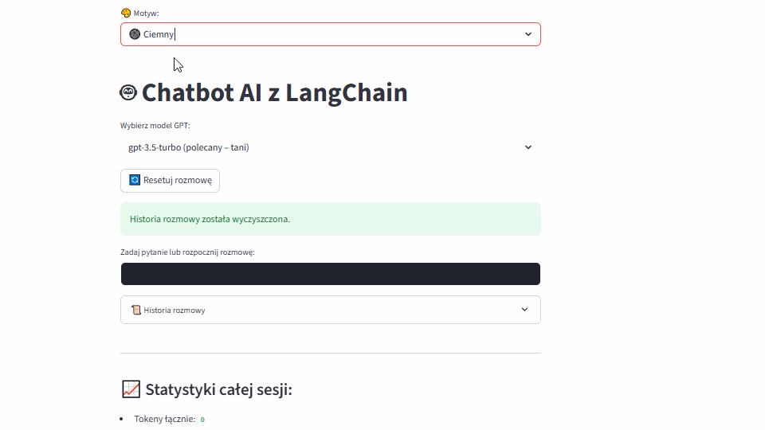

# 🤖 Chatbot AI (LangChain + OpenAI API)

Prosty chatbot AI zbudowany przy użyciu frameworku **LangChain**, z integracją z **OpenAI GPT API** oraz interfejsem graficznym w **Streamlit**.  
Projekt został zrealizowany jako część mojego rozwoju na stanowisko **AI Developer**.

## 🧠 Funkcjonalności

- Obsługa konwersacji z pamięcią (memory buffer)
- Integracja z OpenAI GPT-3.5 lub GPT-4 (dowolny model)
- Możliwość rozszerzenia o własne dane (RAG)
- Interfejs użytkownika oparty na Streamlit

## 🚀 Demo

>  ← (tutaj możesz wkleić nagrany gif lub zrzut ekranu z działania aplikacji)

## 🛠️ Technologie

- Python 3.10+
- LangChain
- OpenAI API
- Streamlit
- dotenv (do zarządzania kluczem API)

  
## 📦 Instalacja lokalna

1. Sklonuj repozytorium:
   ```bash
   git clone https://github.com/run4theh111z-stack/chatbot-ai
   cd chatbot-ai
2. Zainstaluj wymagane biblioteki:
   pip install -r requirements.txt
3. Utwórz plik .env i dodaj swój klucz API:
   OPENAI_API_KEY=your_openai_api_key
4. Uruchom aplikację:
   streamlit run app.py


🗃️ Struktura plików
chatbot-ai/
├── app.py                # główny interfejs Streamlit
├── .env                  # klucz OpenAI (niewersjonowany)
├── requirements.txt      # zależności Pythona
├── utils.py              # funkcje pomocnicze
└── README.md


🔮 Możliwości rozwoju
Dodanie integracji z własnymi dokumentami (PDF, CSV) – RAG

Wersja webowa z Flask/FastAPI

Historia rozmów i analiza zapytań


👨‍💻 Autor  
Michał Kowalewski  
🎓 Fizyka Techniczna – Politechnika Poznańska  
📧 kowalewski.michal04@gmail.com  
🌐 https://github.com/run4theh111z-stack) 

💡 Projekt stworzony w celach edukacyjnych i rozwojowych. Otwartość na feedback i współpracę – jeśli chcesz przetestować, daj znać!
  
